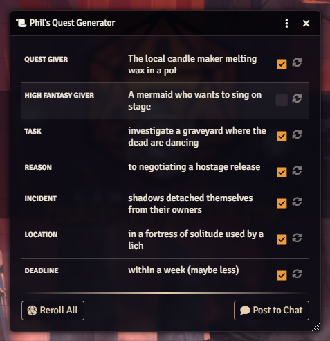

# Phil's Random Quests

 

**Ein einfaches Modul für sofortige Abenteuer-Ideen.**
 
*A simple module for instant adventure ideas.*

> [!TIP]
> ### 💡 Support
> Dieses Modul ist kostenlos und Open Source. Wenn es dir gefällt, freue ich mich über Feedback!

 
<!-- Placeholder for Cover Image -->
<!--  -->

 

#  Deutsche Beschreibung

**Phil's Random Quests** generiert per Klick komplette Abenteuer-Aufhänger. Egal ob du improvisieren musst oder Inspiration suchst – dieses Modul liefert dir sofort Auftraggeber, Ziel, Grund, Ort und Zeitlimit.

## ✨ Hauptfunktionen

### 1. 🎲 Quest Generator
Erstelle komplexe Quest-Prompts aus 7 Kategorien:
*   **Auftraggeber:** Wähle zwischen "Realistisch" (z.B. Wachmann) und "High Fantasy" (z.B. sprechender Schädel).
*   **Aufgabe:** Was muss getan werden? (z.B. "Untersuche die seltsamen Lichter").
*   **Grund:** Warum tun die Helden das? (z.B. "Um eine alte Schuld zu begleichen").
*   **Auslöser:** Was ist gerade passiert? (z.B. "Ein Stern ist vom Himmel gefallen").
*   **Ort:** Wo findet das Ganze statt?
*   **Zeitlimit:** Wie viel Zeit bleibt?

### 2. 🛠️ Smart UI
*   **Clean Design:** Übersichtliches 3-Spalten-Layout.
*   **Kontrolle:** Per Checkbox wählen, welche Teile im Chat gepostet werden.
*   **Logik:** Wählst du den Fantasy-Auftraggeber, wird der realistische automatisch abgewählt.

### 3. 📝 Anpassbar
*   Die Listen sind einfache Textdateien (`.md`) im Modulordner.
*   Bearbeite sie nach deinen Wünschen und klicke im Fenster einfach auf "Listen aktualisieren" – fertig!

---

## 📦 Installation
1.  In Foundry VTT auf **Add-on Modules** -> **Install Module**.
2.  Manifest URL eingeben: `https://github.com/PhilsModules/phils-random-quests/releases/latest/download/module.json`
3.  Installieren & Aktivieren.

## 📖 Erste Schritte
1.  Das Modul erstellt automatisch ein Makro **"Phil's Random Quests"**.
2.  Klicke darauf, um den Generator zu öffnen.
3.  Klicke auf die Würfel-Icons, um einzelne Teile neu zu würfeln, oder unten auf "Alles neu würfeln".
4.  Poste das Ergebnis in den Chat!

---

#  English Description

**Phil's Random Quests** generates complete adventure hooks with a single click. Whether you need to improvise on the spot or are just looking for inspiration – this module provides you with a Giver, Task, Reason, Location, Incident, and Deadline instantly.

## ✨ Key Features

### 1. 🎲 Quest Generator
Create complex quest prompts from 7 categories:
*   **Quest Giver:** Choose between "Realistic" (e.g., Guard Captain) and "High Fantasy" (e.g., An ancient turtle).
*   **Task:** What needs to be done?
*   **Reason:** Why are the heroes doing this?
*   **Incident:** What just happened to kick things off?
*   **Location:** Where does it take place?
*   **Deadline:** How much time is left?

### 2. 🛠️ Smart UI
*   **Clean Design:** Clear 3-column layout based on modern standards.
*   **Control:** Use checkboxes to select exactly which parts to post to chat.
*   **Logic:** Selecting the Fantasy Giver automatically deselects the Realistic one.

### 3. 📝 Customizable
*   The lists are simple text files (`.md`) in the module folder.
*   Edit them to your liking and simply hit "Update Lists" in the window header – done!

## 📚 Included Content
*   **700+ Unique Entries:** 100 hand-written entries per category for maximum variety.

## ⚖️ License
**Phil's Random Quests** is licensed under the [GPL-3.0 License](LICENSE).
